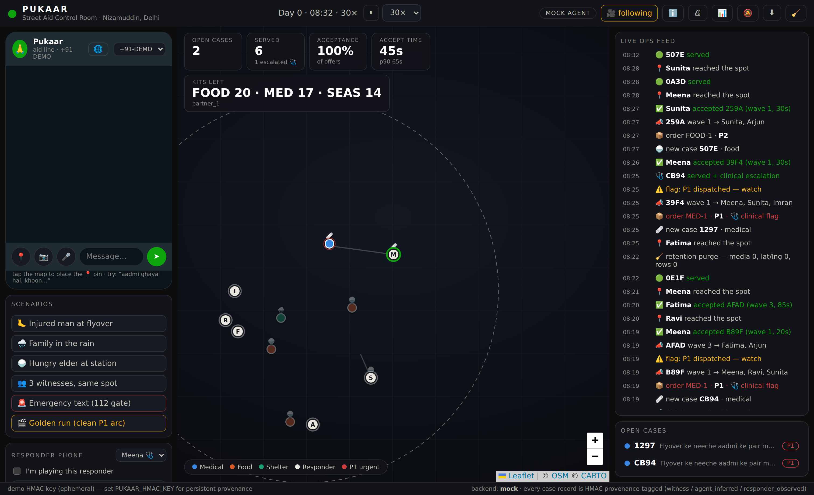
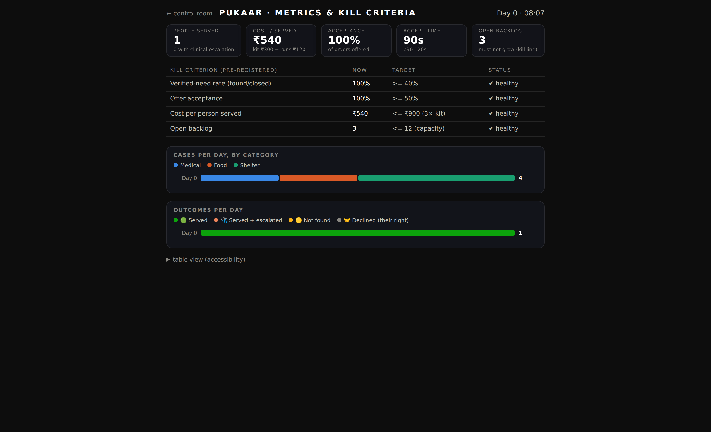
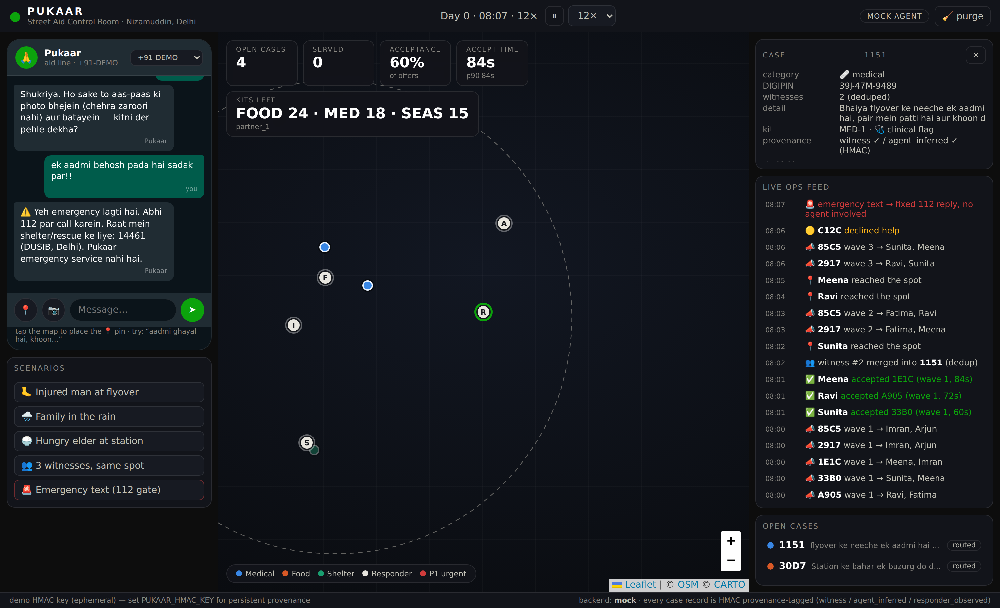
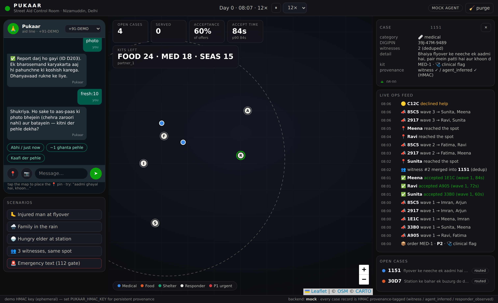
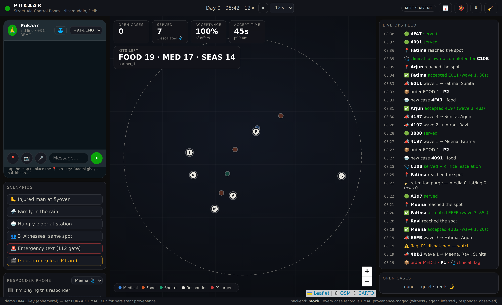
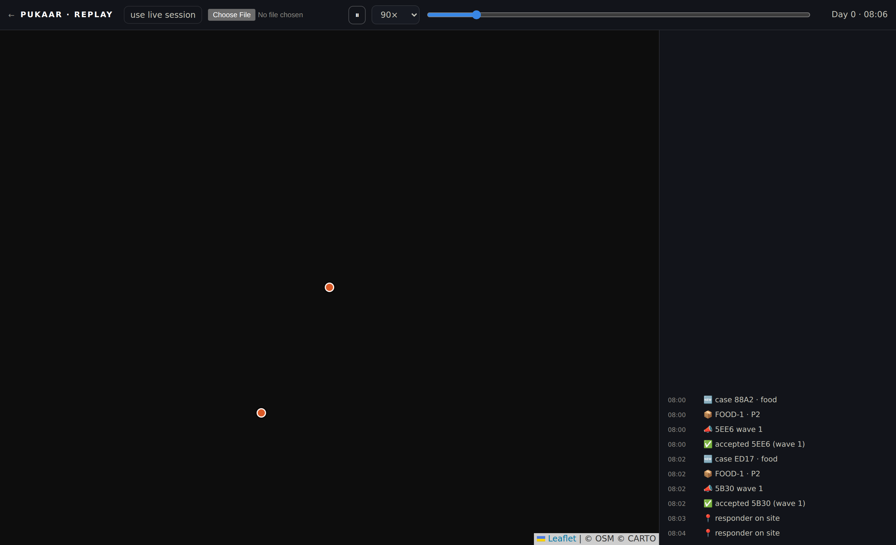
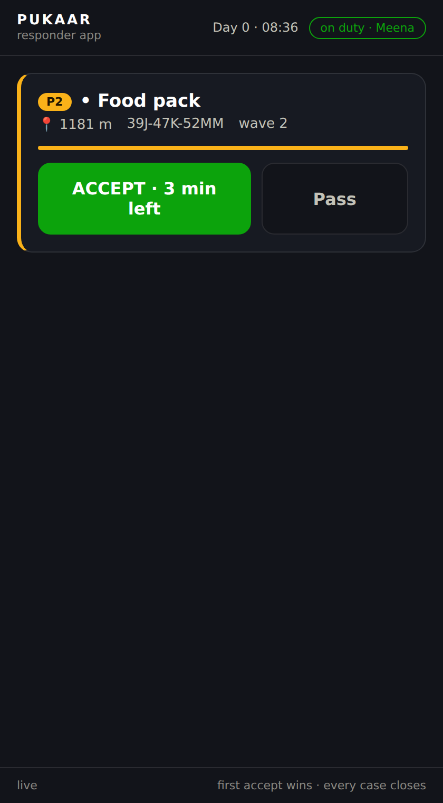
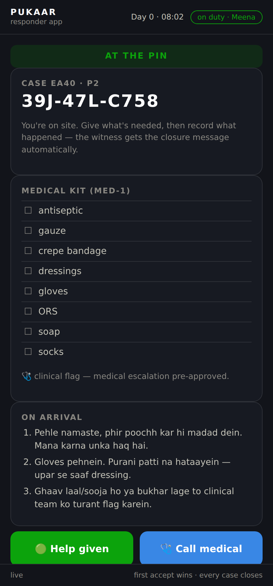

# Pukaar — witness-powered street aid

**Anyone who sees someone in need on the street sends one WhatsApp message.
An agent structures the report, a kit order is built with code-enforced
conservative defaults, and the nearest trusted NGO responder is dispatched
GoodSAM-style — first accept wins. Every case closes with an outcome and a
fixed-string message back to the witness. No cameras, no database of the
poor.**

This is the working implementation of the plan in
[`../research/build-plan.md`](../research/build-plan.md) — every design
decision there (the deterministic 112 gate, ≤4-step intake, parallel-wave
dispatch, retention TTLs, channel provenance) is executable code here, plus
a live **demo control room** you can record.

> **Deploying for real people?** [`../DEPLOY.md`](../DEPLOY.md) has the
> ₹0-to-₹400/month hosting options (one-click Render blueprint included)
> and [`../WHATSAPP-SETUP.md`](../WHATSAPP-SETUP.md) connects a real
> WhatsApp number. The free Telegram line is one env var.

## Quickstart (demo, no keys needed)

```bash
cd pukaar          # or just: make install && make demo
uv venv .venv && uv pip install -p .venv/bin/python -e ".[dev]"
.venv/bin/python -m pytest -q          # 245 tests, all offline
.venv/bin/python -m pukaar             # http://127.0.0.1:8877 — calm board
```

The board boots **calm**: an empty zone, every rider off duty, no
simulated activity. That's the live-pitch mode — open **`/responder`**,
go on duty as a rider (their pin appears at an on-road home spot), then
press a scenario button (or chat as the witness in the phone panel) and
watch the one story you created: intake → case → kit order → offer wave →
your rider collecting the kit at a depot and driving the streets → outcome
→ closure message. Prefer the busy self-running showcase (several riders
working, reports arriving on their own)? `PUKAAR_SEED_DEMO=1` (what
`make demo` sets) or `PUKAAR_SIM_AMBIENT=1`. `MOCK AGENT` badge means the
deterministic offline backend is driving; set `ANTHROPIC_API_KEY` (or
`PUKAAR_BACKEND=claude`) to switch extraction/routing/assessment to Claude
with structured outputs — same pipeline, same fixed strings.

The responder side is a real app, not just a panel: open
**`/responder`** in a second window (or a phone on the same LAN — a
`/responder?id=resp_3` deep link picks the identity and goes on duty in
one tap) for the standalone **responder app** — go on duty as Meena, get the offer card
(priority, kit, distance, DIGIPIN, accept-countdown), and after ACCEPT
watch yourself drive across the control-room map while the app shows
live metres-to-go, the kit checklist, and the on-arrival instructions;
at the pin it flips to the outcome screen and your tap closes the loop
back to the witness. Also in the control room: a **responder phone**
panel (same takeover, inline), a **coordinator queue** for orders whose
waves exhausted (manual assignment — the human terminal rung, exercised),
**night mode** (dispatch honors the 07:00–21:00 partner window; night
reports get the honest S-EXPECT-NIGHT string and queue for the morning round),
a **▦ 90-day cells** map toggle (the privacy story made visible: after the
purge, coarse cell + count is the only location data that still exists —
so that is all the heatmap can show), a **📷 photo picker** in the witness
phone (four described scenes exercising the assist-only photo path),
**📊 metrics** (per-day stacked charts + the pre-registered kill-criteria
table evaluated live), **🔔 event sounds**, and **⬇ session export**
(full JSON of cases/orders/outcomes/audit for analysis or the video).
The witness loop stays closed end to end: **live progress updates**
(named worker en route → reached → outcome, in the witness's language)
and a **"still there?" re-ping** for stale cases — yes refreshes, no
withdraws honestly (found=0). A **/health** endpoint and a reconnect
banner keep the control room graceful across restarts.

**Trilingual by default:** the bot mirrors each witness's language —
English in, English out; Hinglish in, Hinglish out; Devanagari in,
Devanagari out (🌐 auto, overridable to EN / Hi / अ from the phone
header; every string keeps one canonical ID for audits). **🎤 voice
notes** carry transcripts through the same pipeline (demo transcripts
now, Sarvam STT at P1 — the emergency gate applies to speech too), and
**/static/replay.html** animates any exported session on a map + feed
with a scrubber, for recording clean takes.

The **WhatsApp Cloud API transport is wired** (`/webhook` GET verify +
POST intake, reply-button/location-request/media senders in
`whatsapp.py`, parser fully tested) and dormant until `WA_TOKEN` +
`WA_PHONE_ID` exist (`WA_VERIFY_TOKEN` defaults to `pukaar-verify` for the
webhook handshake) — P1 onboarding is configuration,
not code.

A shot-by-shot recording guide is in [`demo-script.md`](./demo-script.md) —
or let `python scripts/record_demo.py` record a self-narrating video for you
(captions + visible cursor) against a `make demo` server. For hosting:
`make docker-demo` serves the seeded demo on 0.0.0.0:8877 in a container
(pass `-e PUKAAR_ALLOW_INSECURE=1` for a throwaway local run — the image
no longer bakes it in).

**Hosting for real (an NGO pilot):** set `PUKAAR_HMAC_KEY` (boot refuses a
public bind without it), `PUKAAR_ADMIN_TOKEN` (staff gate — without it every
surface, live chat, and export is public; staff open `/login?token=…` once
per device), and `PUKAAR_DB=/data/pukaar.db` on a mounted volume. Serve
behind **HTTPS**: the responder app's home-screen install and push
notifications require a secure origin — on plain HTTP they silently degrade
to in-page beeps. The witness webhooks (`/api/wa/inbound`, `/webhook`) stay
open by design; everything else is behind the staff gate.


## Screenshots

| The golden run (P1 arc, live) | Metrics & kill criteria |
|---|---|
|  |  |
| **The 112 gate firing** | **Case detail: DIGIPIN + provenance** |
|  |  |
| **Boot with `make demo` — pre-staged session** | **Devanagari intake + session replay** |
|  |  |
| **Responder app: the offer ping** | **Responder app: at the pin** |
|  |  |

## What's real vs simulated

| Real (production code path) | Simulated (demo harness) |
|---|---|
| Emergency gate, intake state machine, extraction, routing, order building, dedup, dispatch waves/timeouts/first-accept, outcomes, closure strings, retention purge, HMAC provenance, DIGIPIN, metrics | WhatsApp transport (an HTTP endpoint stands in for the Cloud API webhook), responder humans (sim agents with GoodSAM-informed acceptance), photos/voice (scenario-described), the clock (configurable sim speed) |

The seam is explicit: `whatsapp` transport swaps in at P1 of the build plan
(Meta Cloud API webhook → the same `wa_inbound()`), and responders swap for
real people holding the same order cards.

## Architecture (one screen)

```
witness msg ─▶ gate.py (112 regex, fixed strings, BEFORE any model)
           └▶ intake.py (≤4-step FSM; models only *extract*, never speak)
                └▶ service.py: dedup (geo cells) ─▶ case
                     └▶ orders.py: route (code-first) ─▶ build_order
                          · conservative floors enforced in code
                     └▶ dispatch.py: parallel wave (k=3 P1 / k=2), 3-min TTL,
                          ≤3 waves, first-accept locks, coordinator terminal
                     └▶ outcomes ─▶ fixed closure strings ─▶ witness
records: db.py (SQLite) · provenance.py (HMAC channels) · retention.py (TTL purge)
demo:    sim.py (responders, scenarios) · api.py (FastAPI) · static/ (control room)
```

## The rules the code enforces (not just documents)

- **Safety text is never generated.** The 112 gate (Latin *and* Devanagari)
  and every witness-facing sentence are fixed strings with IDs
  (`strings.py`); the emergency test requires 100% recall and blocks CI
  (`tests/test_gate.py`). The gate also outranks a STOP opt-out — a stopped
  line still gets the fixed 112 redirect, and any fresh text re-opens the
  line per the S-STOP promise (`intake.py`).
- **Uncertainty raises, never lowers.** A medical order with model
  confidence < 0.8 keeps `clinical_flag=true` regardless of what the model
  said (`orders.py`); backend failures fall back conservative + flagged.
- **Structured outputs everywhere.** Witness content is delimited untrusted
  data; models can only answer in JSON schemas (`schemas.py`) — the
  correctness tool doubles as the prompt-injection control.
- **The dangerous database never exists.** Media purge at close/72h;
  lat/lng nulled at 7d once a case closes (an open case's pin survives —
  it's the only way to serve it); closed rows aggregated to coarse cells
  at 90d, and reports that never became a case (including 112 redirects)
  swept on the same clock (`retention.py`, tested). No identity of the
  person in need is ever stored — outcomes are coded enums only.
- **Provenance on what matters most.** Witness statements and agent
  inferences are HMAC-signed (`provenance.py`); responder observations and
  system actions carry provenance labels in the audit log — an agent's
  guess can never masquerade as something a human said.
- **Resilience & abuse guards.** Conversations persist to SQLite, so a
  restart never strands a witness mid-intake; a per-witness message budget
  answers floods once then goes quiet (the 112 gate always bypasses it);
  the Meta webhook verifies `X-Hub-Signature-256`; a non-local bind without
  `PUKAAR_HMAC_KEY` refuses to start; `/health` reports `tick_age_s` for a
  dead-loop watchdog (`service.py`, `whatsapp.py`, tested).

## Honest limits (deliberate, per the build plan)

- The Claude backend's photo path takes a *described* photo in the demo;
  the production swap is an image content block on the same call — the
  assist-only semantics (category/urgency hint, never diagnosis) do not change.
- Voice notes flow as transcripts end to end; real STT (Sarvam/Whisper bake-off) is the P1 task.
- The WhatsApp transport is simulated; Cloud API onboarding is P1 week 3.
- DIGIPIN encode/decode round-trips to <10 m and produces the correct
  `39J…` prefix for Delhi, but cross-checking against India Post's official
  lookup remains a listed pre-launch task.
- Sim outcome rates are plausible fictions for demo purposes; the pilot's
  kill-criteria numbers come from reality, not this sim.

## Config

| Env | Default | Meaning |
|---|---|---|
| `PUKAAR_BACKEND` | `auto` | `mock` / `claude` / `auto` (claude iff key present) |
| `PUKAAR_MODEL_INTAKE` | `claude-haiku-4-5` | extraction model |
| `PUKAAR_MODEL_REASONING` | `claude-sonnet-4-6` | routing/assessment/photo model |
| `PUKAAR_HMAC_KEY` | (ephemeral) | provenance key — set for persistence |
| `PUKAAR_DB` | (in-memory) | set a file path to persist the demo DB across restarts |
| `PUKAAR_PORT` | `8877` | demo port |
| `PUKAAR_HOST` | `127.0.0.1` | bind address (`make docker-demo` uses 0.0.0.0) |
| `PUKAAR_SEED_DEMO` | (unset) | pre-stage the photogenic demo session at boot (`make demo` sets it) |
| `WA_APP_SECRET` | (unset) | Meta app secret — when set, `/webhook` verifies `X-Hub-Signature-256` |
| `PUKAAR_ALLOW_INSECURE` | (unset) | permit a public bind without an HMAC key (throwaway demos; the Docker image sets it) |
