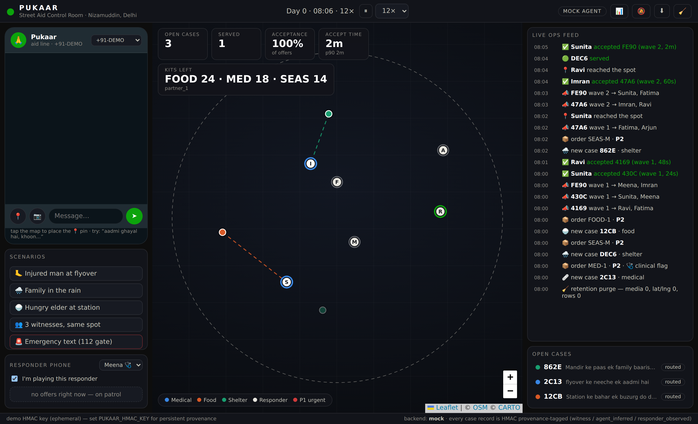

# Pukaar — witness-powered street aid

**Anyone who sees someone in need on the street sends one WhatsApp message.
An agent structures the report, a kit order is built with code-enforced
conservative defaults, and the nearest trusted NGO responder is dispatched
GoodSAM-style — first accept wins. Every case closes with an outcome and a
fixed-string message back to the witness. No cameras, no database of the
poor.**

This is the working implementation of the plan in
[`../research/build-plan.md`](../research/build-plan.md) — every design
decision there (the deterministic 112 gate, ≤4-step intake, parallel-wave
dispatch, retention TTLs, channel provenance) is executable code here, plus
a live **demo control room** you can record.

## Quickstart (demo, no keys needed)

```bash
cd pukaar
uv venv .venv && uv pip install -p .venv/bin/python -e ".[dev]"
.venv/bin/python -m pytest -q          # 39 tests
.venv/bin/python -m pukaar             # http://127.0.0.1:8877
```

Open the URL, press a scenario button (or chat as the witness in the phone
panel), and watch: intake → case → kit order → offer waves → responder
moving on the map → outcome → closure message. `MOCK AGENT` badge means the
deterministic offline backend is driving; set `ANTHROPIC_API_KEY` (or
`PUKAAR_BACKEND=claude`) to switch extraction/routing/assessment to Claude
with structured outputs — same pipeline, same fixed strings.

Also in the control room: a **responder phone** (pick Meena, tick *"I'm
playing this responder"*, and accept/decline/close orders yourself while
the sim plays everyone else), a **coordinator queue** for orders whose
waves exhausted (manual assignment — the human terminal rung, exercised),
**night mode** (dispatch honors the 07:00–21:00 partner window; night
reports get the honest S-NIGHT string and queue for the morning round),
**📊 metrics** (per-day stacked charts + the pre-registered kill-criteria
table evaluated live), **🔔 event sounds**, and **⬇ session export**
(full JSON of cases/orders/outcomes/audit for analysis or the video).

The **WhatsApp Cloud API transport is wired** (`/webhook` GET verify +
POST intake, reply-button/location-request/media senders in
`whatsapp.py`, parser fully tested) and dormant until `WA_TOKEN` +
`WA_PHONE_ID` + `WA_VERIFY_TOKEN` exist — P1 onboarding is configuration,
not code.

A shot-by-shot recording guide is in [`demo-script.md`](./demo-script.md).


## Screenshots

| Control room (live) | Metrics & kill criteria |
|---|---|
|  |  |
| **The 112 gate firing** | **Case detail: DIGIPIN + provenance** |
|  |  |

## What's real vs simulated

| Real (production code path) | Simulated (demo harness) |
|---|---|
| Emergency gate, intake state machine, extraction, routing, order building, dedup, dispatch waves/timeouts/first-accept, outcomes, closure strings, retention purge, HMAC provenance, DIGIPIN, metrics | WhatsApp transport (an HTTP endpoint stands in for the Cloud API webhook), responder humans (sim agents with GoodSAM-informed acceptance), photos/voice (scenario-described), the clock (configurable sim speed) |

The seam is explicit: `whatsapp` transport swaps in at P1 of the build plan
(Meta Cloud API webhook → the same `wa_inbound()`), and responders swap for
real people holding the same order cards.

## Architecture (one screen)

```
witness msg ─▶ gate.py (112 regex, fixed strings, BEFORE any model)
           └▶ intake.py (≤4-step FSM; models only *extract*, never speak)
                └▶ service.py: dedup (geo cells) ─▶ case
                     └▶ orders.py: route (code-first) ─▶ build_order
                          · conservative floors enforced in code
                     └▶ dispatch.py: parallel wave (k=3 P1 / k=2), 3-min TTL,
                          ≤3 waves, first-accept locks, coordinator terminal
                     └▶ outcomes ─▶ fixed closure strings ─▶ witness
records: db.py (SQLite) · provenance.py (HMAC channels) · retention.py (TTL purge)
demo:    sim.py (responders, scenarios) · api.py (FastAPI) · static/ (control room)
```

## The rules the code enforces (not just documents)

- **Safety text is never generated.** The 112 gate and every witness-facing
  sentence are fixed strings with IDs (`strings.py`); the emergency test
  requires 100% recall and blocks CI (`tests/test_gate.py`).
- **Uncertainty raises, never lowers.** A medical order with model
  confidence < 0.8 keeps `clinical_flag=true` regardless of what the model
  said (`orders.py`); backend failures fall back conservative + flagged.
- **Structured outputs everywhere.** Witness content is delimited untrusted
  data; models can only answer in JSON schemas (`schemas.py`) — the
  correctness tool doubles as the prompt-injection control.
- **The dangerous database never exists.** Media purge at close/72h,
  lat/lng nulled at 7d, rows aggregated to coarse cells at 90d
  (`retention.py`, tested), and no identity of the person in need is ever
  stored — outcomes are coded enums only.
- **Provenance on every record.** `witness` / `agent_inferred` /
  `responder_observed`, HMAC-signed (`provenance.py`) — an agent's guess
  can never masquerade as something a human said.

## Honest limits (deliberate, per the build plan)

- The Claude backend's photo path takes a *described* photo in the demo;
  the production swap is an image content block on the same call — the
  assist-only semantics (category/urgency hint, never diagnosis) do not change.
- Voice notes are not wired (Sarvam/Whisper bake-off is a P1 task).
- The WhatsApp transport is simulated; Cloud API onboarding is P1 week 3.
- DIGIPIN encode/decode round-trips to <10 m and produces the correct
  `39J…` prefix for Delhi, but cross-checking against India Post's official
  lookup remains a listed pre-launch task.
- Sim outcome rates are plausible fictions for demo purposes; the pilot's
  kill-criteria numbers come from reality, not this sim.

## Config

| Env | Default | Meaning |
|---|---|---|
| `PUKAAR_BACKEND` | `auto` | `mock` / `claude` / `auto` (claude iff key present) |
| `PUKAAR_MODEL_INTAKE` | `claude-haiku-4-5` | extraction model |
| `PUKAAR_MODEL_REASONING` | `claude-sonnet-4-6` | routing/assessment/photo model |
| `PUKAAR_HMAC_KEY` | (ephemeral) | provenance key — set for persistence |
| `PUKAAR_PORT` | `8877` | demo port |
