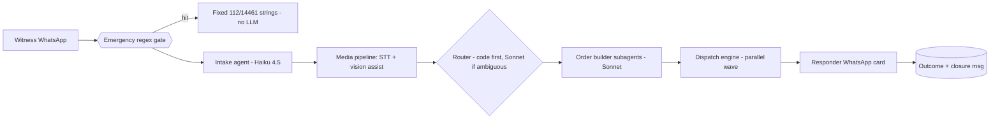

# Pukaar — technical build plan v1 (for review)

Assembled 2026-07-26 from four technical research sweeps (~70 searches: WhatsApp platform, AI stack, dispatch systems, infra/compliance) on top of the earlier landscape research. **Bold decisions are evidence-locked; §10 lists the open questions that need your call.** Sources inline; agent-verified numbers unless marked (unverified).

---

## 1. System at a glance

A witness WhatsApps one number about a person in need. A deterministic emergency gate runs first (112 exit). An intake agent (Haiku) structures the report in ≤4 steps. Specialist calls (Sonnet) turn the case into a kit **order**. A dispatch engine offers the order to the 2–3 nearest on-shift NGO responders in parallel; first accept wins; the responder serves the person and closes the case with buttons. The witness gets a closure message. Nothing about the street resident is ever stored beyond coded outcomes; analytics see only coarse cells.



**Design principles (locked in earlier research, unchanged):** trusted humans face the person, agents only structure and move inventory; safety-critical texts are fixed strings, never generated; privacy by architecture (the dangerous database never exists); channel provenance on every record; code where code works, models only where language/judgment is needed; boring solo-maintainable tech; uncertainty always escalates, never suppresses; never generate more orders than partner capacity.

## 2. Evidence-locked decisions

| Decision | Choice | Why (evidence) |
|---|---|---|
| WhatsApp access | **Meta Cloud API direct** (free test number + 5 whitelisted testers for dev; AiSensy ₹0-plan as fallback; never Twilio — it charges $0.005/msg *inbound*) | All witness-initiated flow rides the **free 24h service window** (service messages free since 2024-25); utility templates ~₹0.115 and free in-window; unverified-business cap (250 business-initiated/day) irrelevant at pilot scale; **Udyam registration (free, Aadhaar+PAN, no company) unlocks verification** |
| Intake model | **claude-haiku-4-5** ($1/$5 per MTok), temp 0, structured outputs | Cheap, vision-capable; **system prompt built as one stable ≥4096-token block** — Haiku's minimum cacheable prefix, so caching (~0.1× reads) actually engages |
| Reasoning calls | **claude-sonnet-4-6** (or sonnet-5 at intro $2/$10 until 2026-08-31) for photo assist, ambiguous routing, order generation; `strict: true` tool schemas | Structured outputs are GA (`output_config.format json_schema`); prefills are removed on 4.6+ models — schema enforcement is also an OWASP-recommended injection defense |
| Agent harness | **Plain Messages API + SDK tool runner. NOT the Claude Agent SDK** | Agent SDK is a filesystem/command harness — wrong shape for a bounded server-side triage flow; "subagents" are plain routed second calls |
| Voice notes | **Sarvam Saaras v3** (₹0.5–1.5/min; code-mixed + noisy-audio trained; powers UIDAI grievance and Indian gov voice stacks); fallback OpenAI transcribe ($0.003–0.006/min, OGG/Opus-native) | WhatsApp voice notes are OGG/Opus; Saaras v3 is purpose-built for exactly Hinglish street audio (vendor benchmarks beat Whisper-class on Indic; independent Hinglish benchmark absent — validate in P0) |
| Photo analysis | **Assist-only**: category/urgency hints with confidence; never person counts, never fine severity; downsampled (~1.6K tokens) | CrisisMMD zero-shot F1 0.72–0.84 (good enough to flag, not to dispatch); VLMs hallucinate on degraded street photos; ICRC humanitarian-data doctrine: classify condition, never identity |
| Dispatch pattern | **Parallel wave to 2–3 nearest, 3-min accept timeout, first-accept locks; ≤3 waves → coordinator** | GoodSAM (the proven community-responder system): broadcasts to ≤3–5 nearest, first-accept — and its 5–16% acceptance rates prove sequential offers would stall (Lyft dispatch research concurs); minutes not seconds because responders aren't staring at apps |
| Responder vetting | **NGO-vouched + photo ID + manual review; no police checks** | GoodSAM's documented bar — police checks deemed excessive and a deterrent; NGO-employed responders clear it trivially |
| Responder UX | **WhatsApp order card, 3 reply buttons; outcomes via buttons; zero install** | WhatsApp is already informal CHW infrastructure in India (peer-reviewed); CommCare-class apps are overkill for 5–30 responders; cold alert = ₹0.115 utility template |
| Reuse vs build | **Build thin custom core (~3–4k LOC); copy patterns from Trek Medics' Beacon** | Ushahidi (active) does collect/verify/map but has **no dispatch engine**; Sahana mid-pivot; CrisisCleanup is pull-based claiming. Beacon = messaging-first community dispatch in 20+ countries — the architectural sibling |
| Geo | **H3 res-10 + kRing(1) dedup (~130–200m) in-app; Google Geocoding (free 10k/mo covers pilot); DIGIPIN for responder/DUSIB-facing location codes; always pin + landmark text + optional photo** | WhatsApp pins are ±50–250m user-dragged hypotheses; Swiggy/Zomato solved this exact problem with multi-field location capture; DIGIPIN (India Post, 4×4m grid, MIT-licensed, launched May 2025) is the sovereign plus-code |
| Language/runtime | **Python 3.12 + FastAPI + httpx; jobs via `procrastinate` (Postgres SKIP LOCKED); one monolith** | Matches your existing repos (memsub/nightshift/book-dna are all Python+pytest); Cloud API is plain REST; queue research: Postgres-as-queue is production-standard at this scale — no Redis, no broker |
| Database | **One managed Postgres, Mumbai region. No PostGIS** (haversine + H3 suffice) | Hundreds of reports/week is trivial; one DB serves data + jobs + dashboards; India residency not legally required (DPDP Rule 15 negative-list) but cheap and prudent |
| Hosting | **Fly.io `bom` (Mumbai) app + managed Postgres, ~$15–30/mo** (alt: AWS Lightsail + RDS Mumbai ~$15–40/mo) | Fly is the only major PaaS with a Mumbai region; nightly encrypted `pg_dump` to object storage |
| Ops surface | **Appsmith CE self-hosted** (free, unlimited users) as the single coordinator app; weekly metrics pack generated as static HTML | One tool to maintain (pilotitis lesson); NGO coordinators get CRUD + charts without you building UI |
| Eval/QA | **promptfoo** CI (MIT; staying OSS post-OpenAI acquisition) + **Batch API LLM-judge** (50% off) over 100% of routing decisions nightly, judge validated vs human golden set (Cohen's κ) | Public bots get played with (Air Canada held *legally liable* for its bot's words; NYC MyCity advised law-breaking for months) — regression-gated prompts + audit are non-negotiable |

## 3. Life of a case, step by step

1. **Witness sends anything** — text ("aadmi ghayal hai flyover ke neeche"), a photo, a voice note, or just "help".
2. **Deterministic pre-gate (no LLM):** Hindi/English regex for emergencies (behosh/unconscious, bahut khoon/heavy bleeding, accident, gir gaya + train/vehicle…). Hit → fixed-string reply **S-112** ("Yeh emergency lagti hai — abhi 112 par call karein. Raat ho aur shelter chahiye: 14461.") and stop. Logged as `emergency_redirect`. This gate is also the liability shield — no generated text in the emergency path.
3. **First-contact notice (DPDP Rule 3):** one-time compact notice string — what we collect (your number, the pin, anything you send), why, deletion windows, grievance link — with **[Theek hai ✓] [Updates chahiye?]** buttons (the second collects opt-in for the closure template).
4. **Intake agent, ≤4 steps** (funnel evidence: 56%→12.6% completion over 16 steps in a comparable WhatsApp program — brevity is a design law):
   - Location: if no pin yet → `location_request_message` (native "send location" button). Text landmark accepted as fallback (`geo_conf=low`).
   - Category: one **list message** — Chot/Injury · Bhookh/Hunger · Thand-Baarish/Weather · Shelter · Kuch aur.
   - One optional combined ask: photo *of the surroundings* ("aadmi ka chehra zaroori nahi") + "kitni der pehle dekha?"
   - Confirm + report ID + honest expectation string (**S-EXPECT**, policy-driven, never generated).
   Every turn is one Haiku call: input = conversation + case-so-far; output (JSON schema) = `{reply_text, buttons[], case_patch, done}`. Max 8 turns then finalize-with-what-we-have. Language mirrors the witness (Hindi/English/Hinglish).
5. **Media pipeline (server-side, not agent tools):** WhatsApp media URLs expire in **5 minutes** — webhook handler downloads immediately to object storage (encrypted, TTL-tagged). Voice → Saaras v3 → transcript joins the conversation. Photo → downsample → one Sonnet vision call → `{category_hint, urgency_hint, confidence}` (assist-only).
6. **Dedup:** new case lands in an H3 res-10 cell; any open case in kRing(1) within 12h → merge as an additional witness (CrisisCleanup's repeat-caller lesson). Three witnesses of one man = one case.
7. **Routing:** if intake category confidence ≥0.8 → route in code, no LLM. Else one Sonnet call → `{primary, addons[], confidence}`. Multi-need = primary + addons, never two orders.
8. **Order builder (one Sonnet call per case, strict schema):**
   - *Medical:* `{sku: MED-1, addons ⊆ fixed list, clinical_flag, priority P1/P2/P3, instruction_ids ⊆ fixed list, confidence}`. **Any wound/illness → clinical_flag=true unless high-confidence minor; low confidence → flag true** (conservative default enforced in code, not prompt).
   - *Food:* `{sku: FOOD-1, water_addon, qty_hint, priority}`; heat-wave rule adds ORS/water.
   - *Shelter/weather:* `{sku: SEAS-M|SEAS-W, shelter_interest_prompt}` — if the person may want a shelter bed, the responder card includes the ask; a yes routes to **DUSIB 14461 / their WhatsApp line** (integrate, never duplicate the state system).
   - `instruction_ids` map to pre-written Hindi strings (e.g. MI-3: "Ghaav dikh raha hai — gloves pehnein, purani patti na hataayein"). Invalid JSON → one retry → conservative fallback order + coordinator flag.
9. **Dispatch (the GoodSAM-shaped engine):**
   ```
   wave = 0
   while wave < 3 and not accepted:
       k = 3 if priority == P1 else 2
       candidates = nearest_on_shift(order, k, exclude=already_offered,
                                     cap: responder_open_orders < 3)
       offer_all(candidates, ttl=3min)      # order card; utility template if no open window
       accepted = first_accept_or_timeout(3min)
       wave += 1
   if wave expired outside 07:00-21:00: requeue for the morning round (night timeouts stay wave-eligible)
   elif not accepted: coordinator_alert(order)  # terminal rung inside the window, always a human
   P1 additionally pings the coordinator at wave 0.
   ```
   Queue cap: if a partner's open orders exceed their declared capacity, new P2/P3 cases hold with an honest witness message — the system must never manufacture NGO backlog.
10. **Responder flow (all buttons, no typing):** order card (category, freshness, DIGIPIN + map link, photo if any, kit to carry, instruction strings) → **[Accept] [Decline] [Busy]** → on accept: pin + navigation → **[Pahunch gaya]** → outcome: **[Diya/Served] [Nahi mila/Not found] [Mana kiya/Declined] [Doctor bulaya/Escalated]**. Escalated keeps the case open until `escalation_completed` is confirmed by the clinical team.
11. **Close:** witness gets **S-CLOSURE** (utility template if window closed, ~₹0.115; free if open — only sent to opt-ins). Media purged at close or 72h, whichever first. Exact lat/lng nulled at day 7 once the case is closed (H3 cell kept; an open case keeps its pin — it is the only way to serve it). Closed case rows aggregated at day 90; reports that never became a case are swept on the same 90-day clock.
12. **Night mode:** intake runs 24/7; dispatch honors partner shift windows (e.g. 07:00–21:00). Night P1 → **S-NIGHT** fixed strings (112, DUSIB 14461 + 011-23378789 + their WhatsApp 9871013284; DUSIB's 16 rescue vans run 22:00–04:00 in winter) and queues for the morning round. Honest copy, never "someone is on the way" at 2am.

## 4. Data model (Postgres; UTC; nightly purge job enforces every TTL)

| Table | Key fields | Retention |
|---|---|---|
| `reports` | case_id, reporter_hash (salted), wa_msg_ids, lang, body_ref, media_refs[], provenance=`witness`, hmac | body 90d; media 72h/close |
| `cases` | status (new→routed→offered→accepted→enroute→closed/expired/emergency_redirect), category+conf, urgency, h3_r10, lat/lng+geo_conf, landmark_text, freshness_min, merged_witnesses | lat/lng→NULL at 7d and row→aggregate at 90d, both once closed (open cases keep pin + row until finished) |
| `orders` | case_id, sku, addons[], clinical_flag, priority, partner_id, created_by (`agent:medical`…), confidence, hmac | 90d |
| `assignments` | order_id, responder_id, offered_at, responded_at, response (accepted/declined/timeout) | 90d |
| `outcomes` | found, served, person_accepted, escalated(+completed_at), closed_by, **coded enums only — no free text about the person** | 1y (no PII) |
| `responders` | partner_id, display_name, wa_hash, zones[], shift_windows, vetting (verified/pending), active | life of roster |
| `partners` | name, capabilities (medical/food/shelter), zone_caps, contacts | — |
| `inventory` | partner_id, sku, count, restock_threshold | — |
| `audit_log` | append-only: ts, actor, action, object, provenance channel, hmac (memsub pattern; key in KMS/env, rotated) | **≥1y (DPDP Rule 6) — PII-free by construction** |
| `analytics_cells` | h3_r8, week, category/outcome counts — **the only long-lived geo table** | indefinite (aggregate) |

Provenance channels: `witness` / `agent_inferred` / `responder_observed` — HMAC-tagged at write; consolidation and dashboards trust the verified channel, never content (imported from memsub).

## 5. Privacy, security, compliance (DPDP mapping)

| Obligation | Implementation |
|---|---|
| Rule 3 notice/consent (reporter) | In-chat first-contact notice (itemized, plain-language, Hindi/English) + grievance link; withdrawal = send STOP (honored instantly, as easy as opt-in; the deterministic 112 gate still answers a later emergency text with the fixed redirect, and any fresh message re-opens the line per the S-STOP "write back anytime" promise) |
| Follow-up messages | Sent only to explicit in-chat opt-ins; utility template, cap per number/day |
| Third-party photos (the person) | Legal basis: **DPDP §7(c) medical emergency / threat to health** for genuine-need photos (time-bound — hence deletion at case close); UX instructs "surroundings, not face"; no face detection/matching ever; commentary on bystander photos is a documented grey zone → deletion-by-default is the answer; ICRC doctrine followed (condition, never identity) |
| Security safeguards (Rule 6) | TLS everywhere; at-rest encryption (DB + object storage); least-privilege access, 2FA on every console; **app logs PII-free by construction, retained 1y**; access log on the coordinator app |
| Breach reporting | Pre-written runbook: notify affected users + DPB "without delay", full DPB report ≤72h; annual tabletop drill |
| Retention | Automated (nightly purge job) — exceeds the small-fiduciary legal floor by design |
| Cross-border | Hosted in Mumbai anyway (Rule 15 doesn't require it); Anthropic/Sarvam/Meta engaged as processors — DPA + zero-retention API options verified at P1 (diligence item) |
| Analytics | Aggregate-only cells, §17(2)(b) research/statistical posture; never shared at finer than res-8 |
| Timeline | Soft-enforcement window to Nov 2026, hard by May 2027 — pilot is compliant-by-design from day 1 |

**Abuse & injection defenses:** deterministic 112 gate pre-LLM; all witness content (text, transcript, photo analysis) handled as data — delimited, never as instructions (multimodal injection is a real OWASP class); strict output schemas everywhere (cited among the most effective architectural defenses); tool allowlist, no URL-following; buttons-first UX shrinks the attack surface; per-number rate limits (3 open reports), new-number cooldown, block list + instant STOP handling (block-rate >2% tanks WhatsApp quality rating); outbound-template daily cap (inbound is free, so cost-bombing is structurally bounded); promptfoo red-team suite before launch. The Air Canada precedent (company liable for its bot's statements) is why every policy/safety/medical sentence the bot sends is a fixed string with an ID.

## 6. AI quality plan

- **Golden set** (grown from day 1): 60 synthetic + real transcripts as collected — Hinglish, voice-note transcripts, prank/abuse, ambiguous multi-need, emergencies. CI (promptfoo) gates every prompt change on: routing accuracy ≥90%, over-triage rate bounded, and **emergency-gate recall = 100% (blocking)**.
- **Nightly judge:** Batch API (50% off) LLM-as-judge over 100% of the day's routing/order decisions at pilot volume; judge trusted only after Cohen's κ validation against human labels; disagreements → human queue; monthly drift re-check.
- **Human audit:** every `clinical_flag=false` wound-category case reviewed; stratified 10–20% of everything else; founder shadows responders in weeks 1–4 (fastest honest data).
- **Field metrics** (ambulance/GoodSAM/StreetLink format): median + p90 time-to-accept and time-to-arrive per priority; % offers accepted (GoodSAM's 5–16% is the realistic planning band); % found (beat StreetLink's 23%); % person-level outcome (beat StreetLink's 5%); acceptance-by-the-person rate (dignity gauge); cost per verified need served.

## 7. Costs (pilot, 200 reports/week ceiling)

| Line | ₹/month |
|---|---|
| Meta WhatsApp (utility templates only; inbound + in-window replies free) | ~150–300 |
| Claude API (~₹6/report × ~870: Haiku intake + Sonnet vision/routing/orders + batched judge) | ~5,200 |
| Sarvam STT (in the ₹6 above; listed for visibility) | — |
| Hosting (Fly.io bom: app + Postgres + Appsmith/Metabase container) | ~1,700–2,600 |
| Geocoding (Google free cap 10k/mo) | 0 |
| **Tech total** | **≈ ₹7–8k/month** (≈ ₹3–4k at 50 reports/wk) |

Kits (~₹300 × volume) and responder stipends dominate real cost — as they should; the tech is deliberately cheap.

## 8. Build roadmap

**P0 — Bench prototype (2 weekends).** FastAPI monolith; chat harness instead of WhatsApp (CLI/web); full pipeline on synthetic messages; Haiku intake + Sonnet order calls with strict schemas; H3 dedup; dispatch engine with fake responders; golden set v1 + promptfoo CI; Postgres + purge job. **Exit: ≥90% routing on golden set; 100% emergency recall; end-to-end case in <5 min on the bench.**
**P1 — Live line (weeks 3–5).** Meta Cloud API onboarding (test number day 1; real number + webhook; System-User token); media pipeline (5-min download rule) + Saaras integration (validate OGG ingestion + Hinglish quality vs Whisper on 30 real voice notes); templates approved (closure, responder-alert, restock); responder card flow; Appsmith coordinator app; Fly bom deploy; DPDP notice strings; abuse controls; breach runbook; **staged field drill: 25 end-to-end cases with 3 friends as responders. Exit: drill p50 report→closure <4h; zero unhandled webhook errors over a week.** File Udyam registration; apply to Glific AI Chatbot Accelerator (next cohort) + Turn.io TechSoup discount in parallel — funding/legitimacy, not dependencies.
**P2 — Pilot (weeks 6–12, with partner).** Responder vetting + roster onboarding; inventory + restock loop; SLA alerts; weekly metrics pack; judge + audit routine live; zone seeding (QR posters, RWA groups, guards). **Exit: kill-criteria dashboard green 4 consecutive weeks** (verified-need ≥40%, acceptance ≥50%, cost/served ≤3× kit, backlog not growing).
**P3 — Harden & scale.** HMAC key ceremony + provenance audit tooling; second NGO node (prove NGO-agnostic onboarding); rider-flag experiment; DUSIB data-handoff conversation (their format, their directory); open-source cut (the pilotitis exit: a maintained shared codebase + institutional owner, not a founder-dependent bot).

## 9. Sustainability by design (why pilots die, engineered against)

The civic-tech graveyard evidence is blunt: pilots die when funding ends and no institution owns them; big early funding doesn't predict survival; discontinued projects are almost never adopted by new maintainers; Uganda declared a moratorium on mHealth pilots after 23 straight deaths. Pukaar's counters, built into the plan above: **(1)** the institutional handoff *is* the product — partner NGO owns operations progressively from P2, DUSIB integration from P3, open-source exit explicit; **(2)** minimal standing surface — one monolith, one DB, one ops app, no exotic infra; **(3)** integrate-don't-duplicate — 112 and 14461 are wired into the flows as first-class citizens, not competitors; **(4)** small recurring funding beats one grant — tech runs on <₹10k/month precisely so a single modest donor or the Glific-accelerator path can carry it.

## 10. Open questions for your review

1. **Runtime** — I locked Python/FastAPI to match your repos. Fine, or do you want Node/TS (official Meta SDK exists there)?
2. **Ops surface** — Appsmith CE as the one coordinator app (my rec) vs Metabase-only (read-only, less useful) vs a custom Next.js admin (more control, more maintenance)?
3. **Hosting** — Fly.io bom (my rec: least ops) vs AWS Mumbai (Lightsail+RDS; free-tier year one, more knobs)?
4. **Photo policy** — instruct-no-faces + delete-at-close (my rec, shipped in P1) vs adding an automatic face-blur pass (extra ML surface; P3 candidate)?
5. **Sarvam vs Whisper** — I locked Sarvam pending the P1 bake-off on 30 real voice notes; if its OGG support or pricing disappoints (docs were unreachable), Whisper is one env var away. OK?
6. **Glific Accelerator** — apply for the next cohort (₹30k fee, funded support, NGO network) even though we build on raw Cloud API? My rec: yes, for distribution and legitimacy.
7. **Udyam timing** — file at P1 start (my rec) so verification lands before the pilot needs display-name trust?
8. **Pilot zone** — needs your Delhi knowledge + partner's map. Criteria: your daily radius, partner presence, chemist/RWA density for seeding.

---
*Companion docs: [landscape-findings.md](./landscape-findings.md) · [critique-and-scope.md](./critique-and-scope.md) · [kevin-xu-proposal.md](./kevin-xu-proposal.md) · full source links live in the four research-agent digests summarized in §2.*
