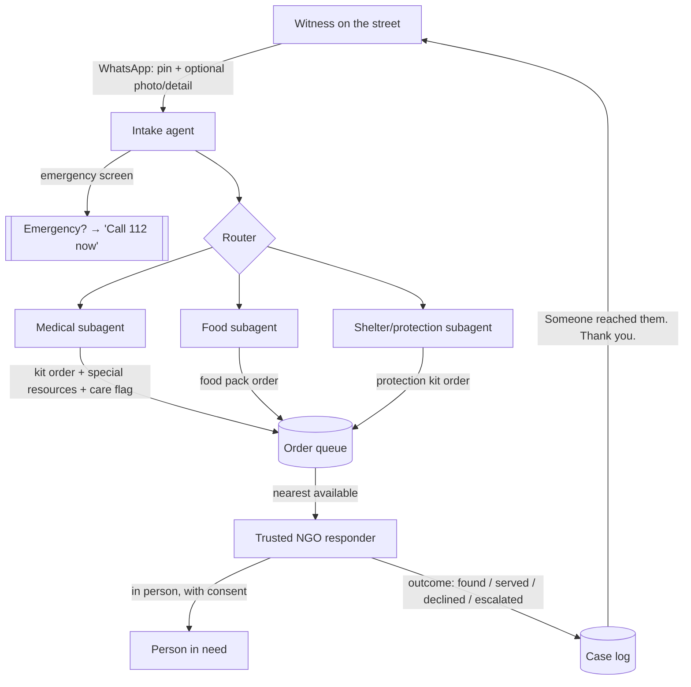

# Pukaar — proposal for the Kevin Xu Innovation Challenge

> **Status:** submission draft. Items in [square brackets] need your personal details before submitting. Built for the challenge's known shape (up to £25,000 non-dilutive; application → semi-finalist workshops on problem definition, experiment design, business case → live pitch at the Rhodes Forum). Confirm the 2026 theme and dates with Equitech when applications open.

---

**Project:** Pukaar (Hindi: "the call") — working title
**One-liner:** An agentic aid network for people on India's streets: any witness sends a WhatsApp; an AI agent structures the report and routes it to a medical, food, or shelter subagent, which places a kit "order" — and the nearest trusted responder from a partner NGO delivers it, in person, with dignity.
**Applicant:** Rustom Dubash, Equitech Futures alum [cohort/program, 1 line]
**Ask:** £24,000 over 12 months | **Location:** Delhi, India (zone 1 + winter expansion) — architecture is city- and NGO-agnostic by design
**Partners:** 2–3 NGOs per zone as supply and response nodes [in discussion — candidates include street-medicine/mobile-health-van orgs, feeding programs, and material NGOs such as Goonj]

---

## 1. Executive summary

Last month I walked past a homeless man whose wrapped foot was bleeding through the bandage. ₹200 of antiseptic, fresh dressings, and a raincoat would have changed his week. Nobody stopped — not because nobody cared, but because there was nothing to plug that moment of caring into.

Pukaar is that plug. A witness sends a WhatsApp message; an AI intake agent captures the location, invites detail and a photo, and screens for emergencies. A router hands the case to one of three specialist subagents — **medical**, **food**, or **shelter/protection** — which converts it into a structured *order*: which standardized kit, what special resources, what priority, which partner. The order goes to the nearest **trusted responder** from a partner NGO, who goes to the person, talks with them, and serves the need — including escalation to clinical care when a kit isn't enough. Every case closes with a logged outcome, and the witness gets one message back: *"Someone reached the person you reported. Thank you for stopping."*

Our research (65+ sources, July 2026) found that **no system anywhere closes this loop** — reporting apps exist (StreetLink, UK), charitable delivery rails exist (DoorDash Project DASH), aid-kit logistics exist, street medicine exists, but nobody connects witness → structured triage → material response → care. And the "obvious" AI approach — cameras scanning streets for people in need — is a documented dead end that we studied and rejected. Pukaar's AI works on *witness reports, never on people*: agents structure compassion into logistics, and the only actor who ever faces the person in need is a trusted human.

## 2. The problem

India's official count of homeless people is 1.77 million (Census 2011); activists hold the real figure to be a multiple of that. They are disproportionately invisible to formal systems — unaddressed, often phoneless, and in ~20 states still subject to criminal begging laws. The consequences are most acute at street level: untreated wounds, exposure in monsoon and winter (Delhi NGOs have counted hundreds of cold-linked deaths in a single winter), and minor conditions that become emergencies for want of ₹200 of supplies and one clinical look.

The failure is not compassion or capacity — passersby care, outreach teams exist, surplus material exists. The failure is **connective**: the moment of witnessing and the machinery of response are not wired together. The UK's StreetLink proves both halves: 170,000+ citizens filed reports (the supply of witness compassion is real), but the person was found only 23% of the time and only ~5% reached lasting help — unstructured, slow loops squander that compassion. The missing infrastructure is fast triage, material response, and a closed loop. That is precisely what agentic AI is good at — if it is pointed at the reports and kept away from the people.

## 3. What we learned before designing this (evidence base)

A four-track research sweep (detection technology; delivery/CSR rails; open source and apps; law and ethics) shaped five design commitments:

1. **Camera-based detection of need is a dead end** — technically (San Jose's pilot: 97% accuracy on potholes vs 10–15% on "is someone living in this car"; component shut down 2025 over privacy), legally (India's DPDP Act offers no consent basis; feeds are police-controlled), and morally (Indore's CCTV-monitored "beggar-free" drive files FIRs against people *giving* alms — location data about the poor has a documented enforcement afterlife in India). Pukaar is architected so the dangerous database **never exists**.
2. **Human reporting is proven Indian practice**: Delhi's DUSIB runs a photo→GPS→rescue-van app and helpline (14461); No Food Waste's citizen-pinned "hunger spots" (verify → deliver food to the spot) has fed 285,000+ people. Pukaar generalizes the pattern across need types and adds the agentic triage layer neither has.
3. **The paid-delivery rail for aid is proven** (Project DASH: 8M+ deliveries at normal rider pay) and Indian quick-commerce has street-level medical appetite (Blinkit: 25 ambulances in NCR within a year) — the scale path exists once the loop is proven.
4. **Follow-through is where these systems die** (StreetLink's 23% found-rate). Pukaar's core metrics are found-rate, time-to-serve, and cost per verified need served — not report counts.
5. **Nothing like the full loop exists** anywhere — commercial, governmental, or open source. (Full landscape with ~70 sources in the project repository.)

## 4. System architecture — agents on reports, humans on streets

**Intake agent (the WhatsApp number).** Conversational, multilingual (Hindi/English, code-mixed; voice notes transcribed so low-literacy witnesses aren't excluded). It: captures the location pin (asks for one if missing), invites — never demands — more detail and a photo, timestamps freshness, and runs a hard-coded emergency screen first: unconscious, heavy bleeding, danger → *"Please call 112 now"* and stop. The agent's output is a structured case record: location cell, category, urgency, confidence, evidence.

**Three specialist subagents.** Each converts a case into an *order* — like placing an order in any delivery system, except the SKU is a standardized aid kit and the "special resources" line captures what standard kits miss:

- **Medical subagent:** severity-tiers the case — *supplies-only* (order: medical kit — OTC wound care, ORS, gloves) vs *care-needed* (same order **plus a clinical flag** that routes to a partner with medical capacity: wound infection, fever, anything a kit must not "handle"). Special resources: dressing sizes, crutches, spectacles.
- **Food subagent:** immediate hunger vs recurring need; orders a food/water pack; heat-wave logic adds ORS/water; recurring patterns get pointed to nearby standing feeding programs rather than one-off drops.
- **Shelter/protection subagent:** season-aware — monsoon (raincoat, tarp), winter (blanket, sleeping bag); if the person may want a shelter bed, the order carries a note to also engage the government shelter-rescue rail (in Delhi, DUSIB's system) — Pukaar complements the state, it doesn't replace it.

Subagents also deduplicate (three witnesses of one man become one case, not three dispatches) and prioritize the queue (freshness, urgency, confidence) — the ML-on-reports approach with precedent (DSSG × Homeless Link), now agentic.

**Fulfilment.** Orders route to the **nearest available trusted responder** — a vetted field worker or trained volunteer from a partner NGO, on a zone roster with accept/decline. The responder carries the kits, goes to the pin, and does the only part that must never be automated: the human encounter — consent, conversation, judgment, and on-the-spot verification (the responder *is* the verifier). Outcomes close every case: found / served / declined / escalated; the clinical flag isn't cleared until follow-up care actually happened.

**Guardrails baked into the architecture:**
- Agents structure information and move inventory; **only trusted humans face the person in need.** No gig-style stranger dispatch to vulnerable people.
- **Privacy by architecture:** no names or identifiers of street residents; photos deleted at case close or 72h, whichever first; exact pins nulled 7 days after a case is finished (an open case keeps its pin — it is the only way to serve it); analytics on coarse cells only; witness numbers hashed; contractual bar on sharing with enforcement. In a country that still criminalizes begging, the strongest guarantee is that the sensitive dataset is never created.
- **The medical line is bright:** the system recommends kits and routes to care; it never diagnoses, and emergencies exit to 112 before any agent logic runs — keeping Pukaar firmly outside regulated triage software.
- **Channel provenance on every case record** (imported from the founder's memsub system): witness statements, agent inferences, and responder observations are cryptographically tagged by origin at write time, so an agent's guess can never masquerade as something a human reported — and audits can always reconstruct why the system believed what it believed.
- **NGO-agnostic by design:** any vetted NGO can join as a *response node* (roster of responders) and/or *supply node* (stocks standardized kits, restocked by courier). The network grows by onboarding nodes, not by rebuilding.

**One case, end to end.** A witness passes a man with a bleeding, bandaged foot and sends the number a pin and a photo — 90 seconds. The intake agent confirms it's not a 112 emergency, the router sends it to the medical subagent, which orders *medical kit + clinical flag: possible infected wound* and queues it at priority. The nearest rostered responder — an outreach worker 600m away — accepts, walks over with a kit, cleans and re-dresses the foot, books the partner van's paramedic for a follow-up, and closes the case: *found · served · escalated.* The photo deletes itself. The witness's phone buzzes: *"Someone reached the person you reported today."* Total system time: under two hours; total surveillance created: none.

## 5. Why this answers the challenge's question

The challenge asks how AI can empower people rather than threaten them. Pukaar's answer is structural, not rhetorical:

- **AI where it empowers:** agents give every passerby the power to trigger a competent response (turning 90 seconds of attention into a completed intervention), give NGO responders a structured queue instead of chaos, and give low-literacy witnesses a voice-note-friendly channel.
- **AI refused where it threatens:** no facial recognition, no biometric categorization, no CCTV inference, no risk-scoring of street residents — a documented decision backed by our own research into why those fail (§3.1).
- **Livelihoods:** the roadmap creates *paid* work — responder stipends now; later, normally-paid opt-in "aid drop" deliveries on gig platforms, adding income and meaning to gig work rather than extracting from it.

## 6. Differentiation

The 2025 winner, OpenDoor, connects people experiencing housing insecurity with existing social services — validation that the judges care about this space. Pukaar is complementary and distinct on four axes: it activates **witnesses** (the supply of compassion on every street) rather than requiring the person in need to navigate anything; it moves **physical material** through an ordered kit system, not only referrals; it operates **India-first under Global-South constraints** (phoneless recipients, criminalization risk, DPDP, no address layer); and its AI is **agentic and report-side by explicit anti-surveillance design**. No existing project occupies this position (§3.5).

## 7. Pilot design (the experiment)

**Setting:** one ~3 km² Delhi zone (months 1–6), a second zone for winter (months 7–12). Delhi chosen for existing street-medicine activity, the DUSIB complement, and candidate partner density.

**Primary outcome:** cost per verified need served (target ≤ £8 all-in by month 12).
**Secondary outcomes:** found-rate (≥50% vs StreetLink's 23% benchmark); acceptance rate (≥60% — a dignity gauge); median report→served time (≤24h, urgent cases ≤4h); clinical escalations *completed* (≥300); repeat-witness rate (≥30%).
**Agent-specific measures:** routing accuracy vs human review on a 10% audit sample (target ≥90%); % of reports fully structured without human clarification; false-urgency rate.
**Embedded experiments:** A/B of witness-seeding channels (chemist QR posters vs resident groups vs guard/driver networks) on volume and precision; kit iteration from decline/request logs; months 7–12, a rider-as-witness sub-study (30 opt-in delivery riders, flags/week and verified-rate vs citizen reports).
**Kill criteria (pre-registered):** verified-need rate <40%; acceptance <50%; cost per verified need >3× kit cost; responder backlog growing 4 straight weeks. Results published either way — a rigorous negative result on witness-report precision in an Indian megacity would itself be a contribution.

## 8. Twelve-month plan

- **M1–2** — Partner onboarding (one response node + one supply node minimum); kit v1 workshop with partners and lived-experience advisors; intake agent + subagents + order queue live; 500 kits stocked; entity registration begun; zone seeded.
- **M3–6** — Zone 1 live; weekly ops rhythm; monthly metric reviews against kill criteria; agent audit loop running.
- **M7–8** — Winter surge: zone 2, winter kit SKU, shelter-rail coordination.
- **M9–11** — Rider-as-witness sub-study; 2,500 cumulative kits; second/third NGO node onboarded to prove NGO-agnostic replication; platform conversations begin *with data*; MoU and data-governance templates finalized.
- **M11–12** — Independent evaluation; public report + open-source release (agent prompts and flows, order-queue service, kit specs, privacy architecture, onboarding playbook) so any city/NGO can stand up a node.

## 9. Budget (£24,000 · ≈ ₹25 lakh · founder time pro bono)

| Line | £ |
|---|---|
| Program coordinator, Delhi, 12 months (ops + partner management) | 4,000 |
| Partner field-capacity grants (responder hours & stipends across NGO nodes) | 3,500 |
| 2,500 standardized kits (medical / food / protection SKUs) | 7,000 |
| Dispatch & courier (kit restock + urgent runs) | 1,200 |
| Tech: WhatsApp BSP fees, LLM API usage, hosting, dashboards | 1,300 |
| Legal: Section 8 entity, DPDP compliance review, partner MoUs | 1,500 |
| Dignity design & training (lived-experience advisors; responder modules) | 900 |
| Independent evaluation | 1,500 |
| Zone seeding & community materials | 800 |
| Field ops & travel | 700 |
| Contingency (~7%) | 1,600 |
| **Total** | **24,000** |

## 10. Team & fit

[Rustom Dubash — 2–3 lines: Equitech program/cohort, technical background, current role/city.] Execution evidence — two prior agentic systems built solo by the founder, both with a published honest-negatives discipline: **nightshift**, a verification-gated autonomous coding agent in which every model claim is independently re-verified against ground truth (the audit discipline Pukaar applies to its subagents), and **memsub**, a local-first agent-memory layer with cryptographically signed channel provenance and reproducible attack/defense numbers (98.7% → 0% on its documented poisoning class) — the provenance model Pukaar borrows for witness reports. Founder-led fieldwork is deliberate: the completed design phase included a full landscape and legal review, and the pilot begins with the founder personally shadowing responders and auditing agent decisions — the fastest route to honest data. Warm NGO relationships in Delhi [1 line — e.g., a personal connection at Goonj among candidate supply partners]; response-node shortlist of street-medicine and outreach orgs to be confirmed at submission. Advisors sought through the challenge's mentorship: AI-safety/ethics reviewer, humanitarian-logistics mentor.

## 11. Risks and honesty

The four most plausible failure modes, each with a design answer: **(1) Report noise / low precision** — tight zone, photo and freshness prompts, agent confidence scoring, pre-registered 40% kill line. **(2) Agent triage errors** — conservative defaults (uncertain → medical flag up, never down), 10% human audit sample, 112 exit before any agent logic. **(3) Responder capacity** — capacity grants in the budget; the system never generates more orders than nodes can serve (queue caps); backlog is a kill metric. **(4) Data misuse pressure** (police/municipal requests, partner identity-linkage demands) — the data that could be demanded is never collected; MoUs bar enforcement sharing; we accept losing a partner over this. Extended legal/ethical register (DPDP, medical-software boundary, Good Samaritan scope, gig-worker law) is in the project repository.

## 12. After the grant

The pilot's numbers unlock the scale path: India's platforms already run the exact financing rail Pukaar needs (₹1–10 checkout donations fund 200,000 meals/day at Feeding India) and have proven street-level humanitarian appetite (Blinkit ambulances). Phase next — "Aid Drops" — pitches one platform to make aid kits a checkout donation option and a normally-paid, opt-in delivery type, with Pukaar as the verification and outcomes layer platforms cannot credibly build themselves. Because nodes are NGO-agnostic and the stack will be open source, replication is an onboarding process, not a rebuild: the loop, once proven in Delhi, is a pattern, not a place.

---

*Appendix (project repository): landscape research with ~70 sources · critique & scoping · plan deep-dives · solo-buildability analysis · this proposal · **and a working demo**: the `pukaar/` directory contains a running implementation of the full loop — trilingual intake agent (auto language mirroring), 112 gate covering Latin and Devanagari with a 100%-recall blocking test, parallel-wave dispatch, provenance, retention purge, live control room with map dispatch view, and a standalone responder phone app (`/responder`) — 99 automated tests (hardened by an adversarial multi-agent audit), CI, and a recordable demo (`make demo`).*
